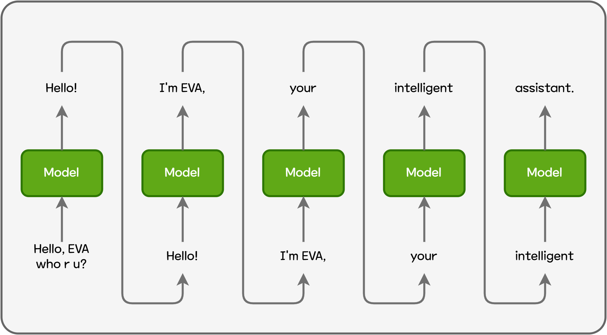
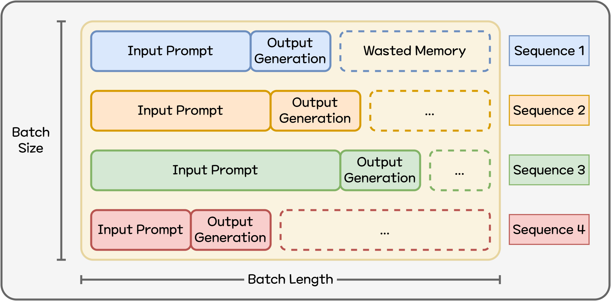
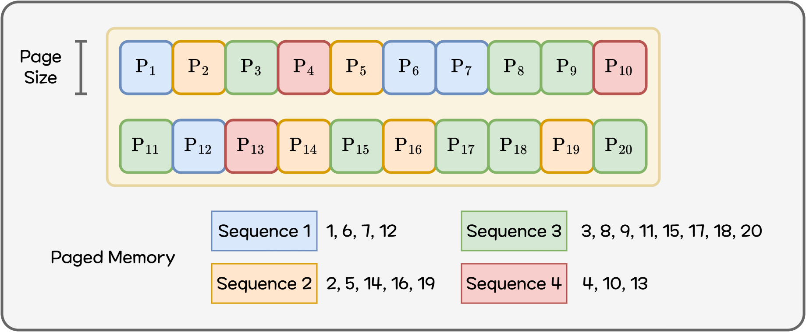
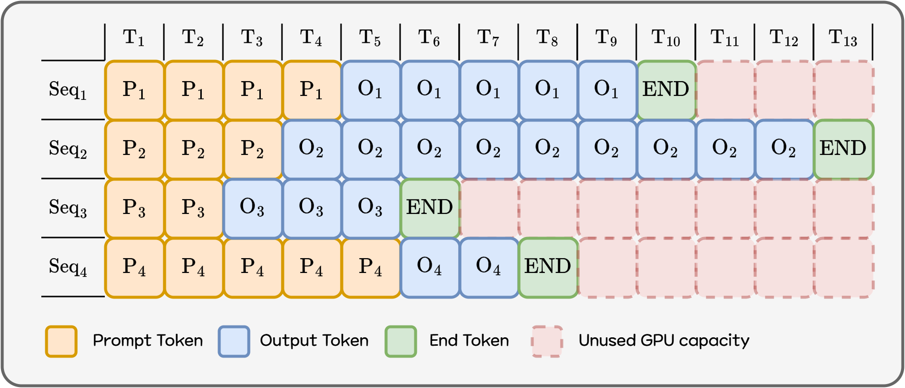
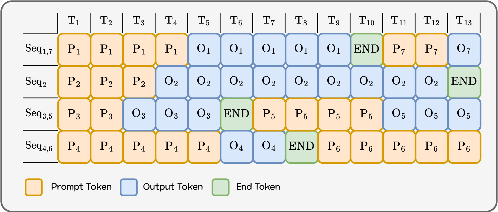
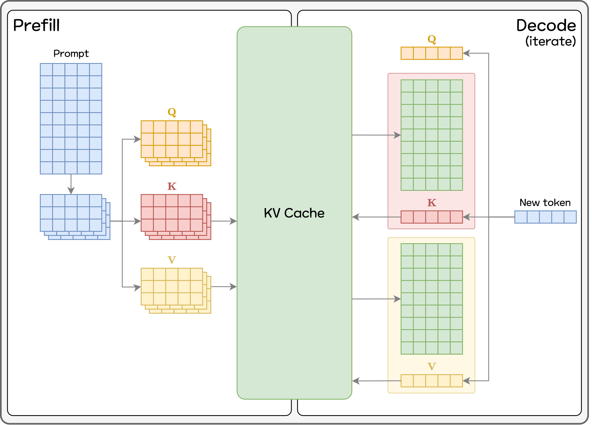
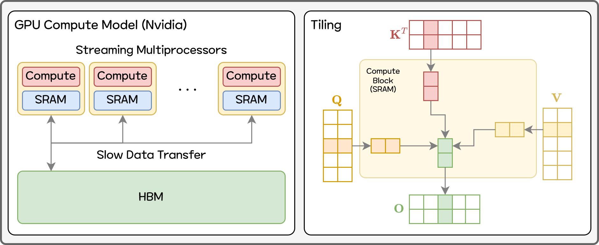
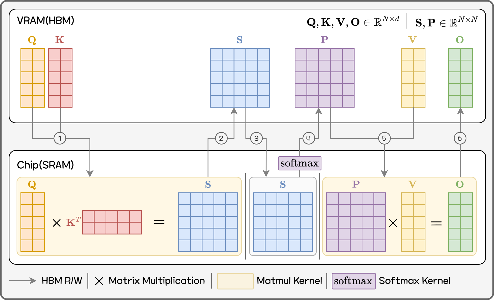
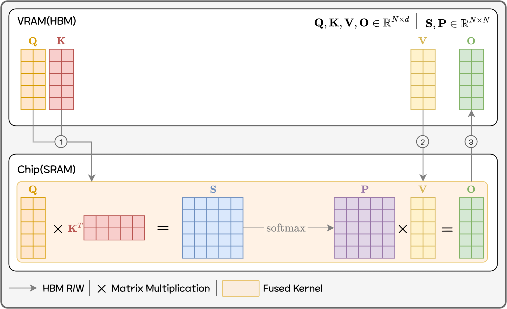

---

slug: Research/
title: GPU and vLLM Optimization for EVA
date: 2025-11-24T12:00
authors:
  - taehoon2.park
tags:
  - tech
  - research
  - eva
  - vllm
  - gpu
  - kv cache
  - paged attention
  - continuous batching
  - chunked prefill
  - flash attention
  - llm service

---

# EVA를 위한 GPU와 vLLM 최적화

이번 글에서는 EVA에서 **LLM 서비스**를 제공하기 위해 최적화한 과정을 알아보려 합니다.
EVA에 맞게 **LLM**을 서빙하기 위해 vLLM을 도입한 사례 및 서빙 핵심 기술을 구체적으로 설명합니다.

---

## 1. 클라우드 LLM vs 로컬 LLM

처음 LLM을 쓸 때 대부분은 **GPT / Gemini / Claude 같은 클라우드 LLM**부터 접하게 됩니다.
모델 운영에 대한 걱정 없이 성능이 가장 좋은 최신 모델을 url과 api key만 있으면 누구나 사용할 수 있기 때문입니다.
하지만 API 사용 비용이 지속적으로 발생하고 데이터가 외부로 전송되기에 개인 정보나 사내 문서 등 보안에 대한 위험성을 동반합니다. 조금만 스케일이 커지면 자연스레 이런 생각이 듭니다.

> “이 정도면 그냥 우리 서버에 모델 올려서 쓰는 게 낫지 않나…?”

로컬 환경에서 쓸 수 있는 LLM도 Alibaba의 Qwen, Meta의 LLaMA 등 다양한 모델이 있습니다.
오픈 소스인 LLM이 많은 만큼 최신 성능의 새로운 모델이 빠르게 출시되며 모델 선택의 폭이 굉장히 넓습니다.
하지만 이를 서비스에 적용하기 위해서는 여러가지 문제점이 있습니다.

먼저 LLM을 그냥 돌리면 추론 속도가 너무 느립니다.
이는 autoregressive 모델인 LLM의 특성 때문입니다.
추론 속도를 획기적으로 줄일 수 있는 KV Cache, Paged Attention 등의 다양한 기술이 있습니다.
이러한 개념들을 적용한 오픈소스가 여러 가지가 있는데 EVA는 vLLM을 사용합니다.
여러 오픈소스도 각 각 지원하는 모델 범위가 다르고 사용 편의성에서도 많은 차이가 있습니다.
이제부터 EVA가 왜 vLLM을 사용했는지 알아보겠습니다.

---

## 2. why vLLM?

저희가 LLM 서빙 엔진을 검토할 때 고려한 사항은 크게 세 가지 입니다.
다양한 모델을 쉽게 운영하면서 납득할만한 성능으로 서비스를 제공할 수 있는가에 초점을 맞췄습니다.
vLLM, LM Deploy와 TensorRT-LLM 세 가지 엔진을 고려했고 vLLM을 선택했습니다.
vLLM은 Hugging Face에 등록된 다양한 모델 중 지원하는 모델이 가장 많고, 까다로운 운영 비용없이 안정적인 성능을 보장합니다.
여러 외부 벤치마크[^1][^2][^3]에서 더 나은 성능을 보여주는 LM Deploy나 TensorRT-LLM도 고려했지만, 지원하는 모델 수가 적거나(LM Deploy) 엔진에 맞는 별도의 모델 변환과정(TensorRT-LLM)이 필요하여 선정하지 않았습니다.

### 2.1. 성능

일반적으로 LLM 서빙 엔진을 비교할 때 보는 기준은 “**얼마나 빨리, 얼마나 많이 처리할 수 있느냐**”입니다.
두 가지 지표를 중점적으로 살펴봤습니다.

- **Throughput**
- **TTFT (Time To First Token)**

Throughput은 말 그대로 **단위 시간당 처리량**입니다.
보통 `tokens/s`(초당 토큰 수)나 `requests/s`(초당 요청 수)로 표현합니다. “GPU가 1초 동안 LLM 토큰을 얼마나 많이 만들어냈냐”에 가까운 개념입니다.

<strong>TTFT (Time To First Token)</strong>은 “요청을 보낸 순간부터, **첫 번째 토큰이 나올 때까지 걸리는 시간**”입니다.
사용자가 체감하는 “로딩 시간”에 거의 그대로 대응되기 때문에 서비스 사용성에 가장 큰 영향을 주는 지표입니다.

vLLM은 **TTFT를 낮게 유지하는 데 강점**이 있습니다.
BentoML 팀이 Llama 3 8B / 70B를 대상으로 vLLM, LMDeploy, TensorRT-LLM 등을 동일 환경에서 비교한 결과, LMDeploy가 토큰 생성 속도(Throughput)에서는 더 높은 수치를 보여주지만, vLLM은 모든 부하 구간에서 가장 낮은 TTFT를 유지했습니다.[^1]

다른 벤치마크에서도 프레임워크마다 상황에 따라 성능 차이가 나지만, 공통적으로 **Throughput·TTFT·전력 효율 등 지표별로 서로 강점이 갈리는 것**을 확인할 수 있습니다.[^2][^3]

### 2.2. 지원 모델 목록

다음은 “**얼마나 다양한 모델을 사용할 수 있는가?**”입니다.
EVA는 특정 모델만 사용하지 않고, 성능/비용이 좋은 오픈소스 모델을 지속적으로 업데이트 하고 있습니다.
엔진에 따라서 특정 모델을 지원하지 않는 경우가 있어 지원하는 모델을 비교했습니다.

- **vLLM** ([지원 모델 목록](https://docs.vllm.ai/en/latest/models/supported_models/))
  - Hugging Face에 올라온 대부분의 메이저 오픈소스 LLM을 지원
  - Embedding, Mamba[^4] 등 다른 구조의 모델도 지원

- **LMDeploy** ([지원 모델 목록](https://github.com/InternLM/lmdeploy/blob/main/docs/en/supported_models/supported_models.md))
  - LLaMA, Qwen, InternLM, DeepSeek, Mixtral 등 다수의 모델을 지원하지만, TurboMind / PyTorch 두 엔진을 적절히 섞어 써야 하고, vLLM이나 TensorRT-LLM 대비 제한적

- **TensorRT-LLM** ([지원 모델 목록](https://nvidia.github.io/TensorRT-LLM/reference/support-matrix.html))
  - NVIDIA가 직접 관리하여 대부분의 LLM 모델을 지원

### 2.3. 운영 편의성

마지막으로 성능만큼 중요하게 고려한 사항은 “**운영이 얼마나 쉬운지**”였습니다. EVA에 적합한 운영을 위해 검토한 사항을 정리했습니다.

- **vLLM**
  - Hugging Face 모델을 그대로 불러오는 구조라, **모델 교체 시 별도 변환 단계가 필요 없음**
  - 공식 문서와 예제가 잘 정리되어 있고, LangChain 등 상위 프레임워크와의 연동 사례도 풍부해  
    EVA의 기존 Python / FastAPI 기반 스택에 쉽게 적용 가능
  - 모델 변경 시, 단순하게 Hugging Face 모델 Repo 이름만 변경하면 되어 관리하기 가장 편리함

- **LMDeploy**
  - **문서와 예제는 잘 갖춰져 있고** TurboMind 엔진 포맷으로의 변환을 자동으로 처리해 주는 등 편의 기능 존재
  - 다만 모델마다 TurboMind / PyTorch 엔진 선택 변환/캐싱 전략 등을 별도로 고민해야 해서 “**모델을 자주 업데이트”하는 구조에서는 신경 쓸 점이 많음**

- **TensorRT-LLM**
  - NVIDIA 생태계에 통합되어 있고, 잘 튜닝하면 매우 높은 성능을 낼 수 있지만, **설정과 엔진 빌드 과정이 가장 복잡함**
  - 모델 별로 체크포인트 변환, TensorRT 엔진 빌드, Triton 설정 등 초기 세팅 비용이 크고, 모델을 바꿀 때마다 이 과정을 반복해야함

EVA는 사용 시나리오가 다양하고 각 시나리오마다 최적화된 모델을 제공하는 것을 우선시합니다.
성능 상 vLLM이 1등은 아니지만, 성능 차이가 서비스 경험을 좌우할 정도로 크지 않다고 판단했습니다.
**LMDeploy / TensorRT-LLM은 조금 더 높은 최대 성능을 노리는 대신 초기·운영상 비용이 큰 편**이고, vLLM은 “성능·모델 호환성·운영 난이도”를 종합적으로 고려했을 때 가장 나은 선택지였습니다.

---

## 3. LLM 서빙 핵심 기술

이제 vLLM과 같은 LLM 서빙 엔진이 단순 LLM 추론 대비 업도적인 성능을 달성할 수 있게 해준 기술을 살펴보고자 합니다.
LLM은 생성한 output를 다시 input으로 활용해서 다음 output을 순차적으로 생성하는 autoregressive 모델입니다.
“**Hello! I'm EVA, your intelligent assistant.**”라는 문장을 생성할 때, 한 번에 전체 문장을 생성하거나 각 단어를 병렬적으로 생성할 수 없습니다.
토큰 이라는 최소 단위를 기준으로 순서대로 답변을 생성합니다.


*<center>Figure 1. Autoregressive 모델 추론 방식</center>*

매 토큰을 생성할 때 마다 이전 모든 토큰에 대한 정보를 필요로 합니다.
예를 들어 마지막 토큰인 **assistant**를 생성하기 위해서는 이미 계산한 앞의 4개 토큰을 다시 계산해야합니다.

### 3.1. KV Cache

매 번 모든 토큰에 대한 계산을 중복적으로 수행할 경우 속도가 느릴 수 밖에 없습니다.
그래서 LLM 모델 서빙할 때는 다음 토큰 계산에 필요한 벡터(Key/Value)를 메모리에 캐싱해두고 그대로 사용하는 KV Cache를 활용합니다.
KV Cache는 LLM을 서빙하는 거의 모든 엔진이 사용할 만큼 근간이 되는 기법입니다.

하지만 그만큼 메모리를 많이 사용하게 되기에 효율적으로 메모리를 관리해야 합니다.
GPU의 메모리에 영향을 주는 중요한 요소는 크게 세 가지를 꼽을 수 있습니다.

- 시퀀스(프롬프트와 답변)이 길어질수록,
- 모델이 클수록,
- 배치에 포함된 요청 수가 많을수록,

KV Cache가 GPU 메모리를 폭발적으로 잡아먹습니다.
즉 KV Cache를 어떻게 관리하느냐에 따라서 한정된 GPU 자원으로 처리할 수 있는 요청이 크게 차이나게 됩니다.
사용자 경험과 비용에 직결되는 부분이기 때문에 서비스를 제공할 때 매우 중요합니다.

### 3.2. Paged Attention

앞에서 본 것처럼 KV Cache는 LLM 서빙의 필수 요소이지만, 동시에 GPU 메모리를 가장 많이 쓰는 주범입니다.
기본적인 KV Cache는 하나의 요청(프롬프트 + 답변)에 대해 **연속된 큰 메모리 덩어리**를 미리 할당해 둡니다.
하지만 요청 마다 필요한 메모리는 다르며 Figure 2처럼 메모리를 효율적으로 할당할 수 없습니다.
각 시퀀스(프롬프트 + 출력)의 길이가 배치의 길이 보다 짧을수록 메모리가 낭비됩니다.
실제 서비스 환경에서 유저마다 요청하는 시퀀스의 길이는 제 각 각이기 때문에 최적의 값을 미리 설정해 두기는 어렵습니다.


*<center>Figure 2. 비효율적인 GPU 메모리 사용</center>*

여기서 vLLM이 도입한 핵심 아이디어가 **Paged Attention**[^5]입니다.
KV Cache를 “페이지(page)” 단위로 잘게 쪼개어 관리하는 방식입니다.
하나의 긴 시퀀스를 여러 개의 page로 나누어 저장해 두고, 시퀀스가 끝나거나 더 이상 필요 없는 부분이 생기면 **그 page는 다른 시퀀스에 할당하여 재사용**합니다.


*<center>Figure 3. Paged 메모리</center>*

하나의 시퀀스를 위해 메모리를 통째로 잡아놓지 않고, 필요없는 메모리 사용을 최소화 하기에 낭비가 거의 없습니다.
결과적으로, **동일한 GPU로 더 많은 요청을 동시에 처리**할 수 있고, 시퀀스 길이가 제각각이어도 필요한 만큼의 page만을 할당하여 KV Cache를 효율적으로 운용할 수 있게 됩니다.

### 3.3. Continuous Batching (Iteration-level Scheduling)

Paged Attention이 메모리를 효율적으로 쓰는 기술이라면, **Continuous Batching**[^6][^7]은 GPU 연산 자체를 최대한 활용하기 위한 기술입니다. 일반적으로 배치 추론은 일정 시간동안 들어온 요청을 한 번에 배치로 만들고, 배치 전체를 끝까지 추론하고 나서 다음 배치를 처리합니다. 하지만 위에서 말했 듯 LLM 요청은 길이가 정해져 있지 않기 떄문에 배치 안에서 가장 오래 걸리는 추론이 끝날 동안 이미 연산이 완료된 요청은 대기열에서 기다립니다. 배치 내에서 먼저 끝난 요청도, 배치에 묶여서 마지막 요청이 끝날 때까지 기다려야만 합니다. 쉽게 말해 GPU가 연산할 수 있는데 놀고 있는 상황입니다.


*<center>Figure 4. Static Batching</center>*

**Continuous Batching(Iteration-level Scheduling)**[^6][^7]은 이걸 토큰 생성 “한 번(iteration)” 단위로 더 잘게 쪼개서 생각합니다. 한 번의 iteration이 끝날 떄 마다 이미 처리가 끝난 요청은 배치에서 바로 제거하고 새로 들어온 요청을 바로 현재 배치에 편성합니다. 즉 배치를 한 번 만들고 끝까지 고정하는 것이 아닌 매 iteration마다 업데이트하는 연속적인 구조로 변경하는거죠.


*<center>Figure 5. Continuous Batching</center>*

GPU가 연산하지 않고 대기하는 시간을 최소화 하고 다음 요청을 바로 바로 처리하기 때문에 같은 시간에 더 많은 유저의 요청을 처리할 수 있게 됩니다. 특히 짧은 요청이 섞인 서비스 환경에서 사용자가 체감하는 시간이 크게 줄어듭니다.
Paged Attention을 통해 GPU 메모리를 효율적으로 사용하고, Continuous Batching을 통해 GPU를 최대한 활용한 상태로 토큰을 생성하게 함으로써, 같은 GPU 메모리로 더 많은 요청을 동시에 처리하면서도 답변 시간도 줄이는 두 마리 토끼를 다 잡는 거죠.

### 3.4. Chunked Prefill

Continuous Batching이 “여러 요청을 토큰 단위로 쪼개서 섞어 돌린다”는 개념이라면, **Chunked Prefill**[^8][^9]은 이 아이디어를 **긴 프롬프트**에 적용한 기술입니다.
LLM 요청은 크게 두 단계로 나눌 수 있습니다.

- **Prefill 단계**: 유저의 프롬프트 전체를 한 번 쭉 읽고 내부 상태(KV Cache)를 쌓는 단계
- **Decode 단계**: 쌓인 상태를 활용해 토큰을 하나씩 이어서 생성하는 단계

프롬프트가 짧을 땐 문제가 없지만, 프롬프트가 길어지면(예: 수천~수만 토큰짜리 시스템 메시지 + 예시 + 스펙),
**prefill 하나가 여러 번의 iteration을 통째로 점유**해 버릴 수 있습니다.
그동안 다른 요청의 decode는 처리되지 못하고 긴 프롬프트에 대한 처리가 끝날 때 까지 기다려야 합니다.


*<center>Figure 6. Chunked Prefill</center>*

Chunked Prefill의 핵심 아이디어는 간단합니다.

> “긴 프롬프트를 여러 조각(chunk)으로 나눠서,
> 각 iteration마다 ‘조각 하나’씩만 처리하고,
> 나머지 토큰 예산은 decode 등 다른 요청에 쓰자.”

한 번의 iteration에서 처리할 수 있는 토큰 수를 일종의 “토큰 예산(token budget)”이라고 생각해 보겠습니다.

- 먼저 **이미 처리 중인 decode 요청들**로 이 예산을 최대한 채우고,
- 남는 예산이 있으면 **긴 프롬프트의 일부분(prefill chunk)** 만 잘라서 같이 처리합니다.
- 긴 프롬프트 전체를 한 번에 처리하는 대신, 여러 iteration에 걸쳐 “조금씩” 진행하는 구조가 됩니다.

이렇게 하면 긴 프롬프트 하나가 들어와도, 다른 요청의 decode가 완전히 막히지 않고 사이사이에 계속 진행될 수 있습니다.
여러 장의 이미지를 분석하는 요청 처럼 긴 요청을 처리하면서도 중간에 들어온 짧은 채팅 등의 요청도 동시에 처리할 수 있게 됩니다.
특정 시나리오 프롬프트가 길다고 해서 전체 GPU가 그 프롬프트 prefill에만 전념하는 상황을 줄일 수 있습니다.

vLLM의 최신 엔진(V1)에서는 이런 **prompt chunking + continuous batching** 전략이 스케줄러 내부에 기본으로 녹아 있어서 , 예전처럼 별도의 설정을 켜지 않아도 긴 프롬프트와 여러 요청을 효율적으로 섞어서 처리할 수 있도록 설계되어 있습니다.

### 3.5. Flash Attention (IO-aware Attention Kernel)

Paged Attention이 “KV Cache를 어떻게 관리할 것인가(메모리 구조)”, Continuous Batching이 “요청을 어떻게 스케줄링할 것인가(일정 관리)”에 가까운 기술이라면, **Flash Attention**[^10][^11]은 한 단계 더 내려가서 LLM 모델의 핵심 연산인 “**Attention 연산 자체를 어떻게 계산할 것인가(커널 알고리즘)**”를 바꾼 기술입니다.
GPU 아키텍쳐를 알아야 하기에 필요한 부분만 간단하게 알아 볼 예정입니다. 실제 GPU 동작방식과 정확히 일치하지는 않습니다.


*<center>Figure 7. Compute on GPU</center>*

Nvidia GPU는 병렬로 같은 패턴의 연산을 반복하는 수십 개의 Streaming Multiprocessor(SM)로 구성되어 있습니다.
각 SM 안에는 다시 수많은 연산 유닛(CUDA core)과, 이 유닛들이 함께 사용하는 작은 on-chip 메모리(SRAM)가 붙어 있습니다.
SRAM의 메모리 용량은 Nvidia RTX A100 기준으로 192KB의 메모리를 가지는 SM이 108개로 구성되어 20MB 정도로 일반적으로 말하는 GPU 메모리와는 큰 차이가 있습니다.

반대로 모델 파라미터처럼 큰 데이터는 GPU 칩 바깥에 있는 HBM(High Bandwidth Memory)에 저장합니다. GPU는 필요한 만큼의 데이터만 HBM에서 가져와서 연산을 수행합니다.
연산 속도 대비 HBM에서 데이터를 가져오는 속도가 느려 주로 여기서 병목이 발생합니다.

큰 행렬 곱을 GPU에서 수행할 때 같은 데이터(하나의 행)가 여러번 필요한데 매번 HBM에서 읽어오게 되면 I/O로 인한 병목 때문에 빠른 연산 속도를 거의 활용하지 못합니다.
기본적으로 큰 데이터는 SRAM에 들어갈 수 있을 정도의 작은 조각(tile)으로 쪼개서 읽어온 후 해당 조각이 필요한 연산을 전부 수행한 결과를 HBM에 쓰는 방식으로 병목을 최소화하도록 설계되어 있습니다.

일반적인 Attention 구현은 다음과 같은 과정을 거칩니다.

1. **Q**와 **K**를 곱해서 N×N 크기의 점수 행렬(score matrix) **S**를 만듭니다.
2. 이 점수 행렬 전체에 softmax를 적용해서 확률처럼 정규화된 가중치 행렬 **P**를 만들고,
3. 이 가중치 행렬과 **V**를 다시 곱해서 최종 출력을 만듭니다.


*<center>Figure 8. Standard Attention</center>*

수식으로 쓰면 간단하지만, 실제 GPU에서는 문제가 생깁니다.
길이가 N인 시퀀스에 대해 Attention을 하면 N×N짜리 거대한 행렬을 통째로 메모리에 만들어야 하고, 이를 여러 번 읽고 쓰면서 softmax와 matmul(행렬곱)을 수행해야 합니다.
그림에서도 확인할 수 있듯이 한 번의 Attention 연산을 하는데 HBM R/W가 최소 6번이 필요합니다.
연산 자체는 GPU가 충분히 감당할 수 있는데, N×N 중간 결과 (**S**, **P**)를 HBM에 쓰고 다시 읽는 IO가 병목이 됩니다.
시퀀스 길이가 늘어날수록 메모리 사용량과 대역폭이 N²으로 커지는 구조인 것이죠.

기존 Attention 구현에서는 **QKᵀ**(행렬곱), **softmax**, **PV**(행렬곱)가 각각 별도의 커널(GEMM → softmax → GEMM)로 나뉘어 있습니다.
Tiling 최적화는 주로 이 GEMM 커널 내부에서만 일어나고, 커널 사이에서는 타일 정보를 공유하지 않습니다.
그래서 **QKᵀ**의 결과인 N×N 점수 행렬 **S**를 한 번 HBM에 전부 써야 하고, 다음 **softmax** 단계가 이 행렬을 다시 HBM에서 읽을 수밖에 없습니다.
실제로는 **mask**, **dropout** 등 다른 커널이 추가적으로 있지만 여기선 생략했습니다.
이 “단계별 HBM R/W”가 길이가 긴 시퀀스에서 IO 병목의 핵심이 됩니다.

Flash Attention의 핵심 아이디어는 아주 단순하게 말하면 “**중간결과 N×N 행렬을 아예 만들지 말자. 조각(타일) 단위로 조금씩, 그 자리에서 바로 softmax와 **V**를 곱해 최종 연산까지 끝내고 버리자.**”입니다.


*<center>Figure 9. Flash Attention</center>*

구체적으로는 **Q**, **K**, **V**를 **GPU의 on-chip 메모리(shared memory, register)에 들어갈 수 있는 작은 블록 단위로 잘라서** 처리합니다.

- **Q**의 한 블록과 **K**의 한 블록을 가져와서 → 그 블록에 해당하는 점수만 계산하고,
- 그 결과를 **즉시 softmax 계산에 반영**한 다음,
- 해당 블록이 기여하는 출력에 바로 누적(accumulate)합니다.
- 이렇게 처리한 블록은 바로 버리고, 다음 블록으로 넘어갑니다.

중요한 점은, 이 과정을 모든 블록에 대해 한 번씩만 수행하면 수학적으로 기존 Attention과 완전히 똑같은 결과가 나온다는 것입니다.
(근사나 샘플링이 아니라, 연산 순서와 메모리 접근 순서만 바꾼 “**정확한(Exact) Attention**”입니다.)
이렇게 하면 Attention의 메모리 사용 구조가 크게 바뀝니다.

- 기존:

  - **Q**, **K**, **V** 외에 **N×N 점수 행렬 / softmax 결과를 통째로 HBM에 저장**
  - 메모리 사용량, IO가 **N²** 규모
- Flash Attention:

  - **Q**, **K**, **V**, 최종 출력 **O**만 HBM에 두고
  - 점수와 softmax 관련 값은 **타일 단위로 on-chip에서만 처리하고 바로 버림**
  - 메모리 사용량, IO가 **N 수준으로 감소**

결과적으로, **메모리 읽고 쓰는 속도(IO) 때문에 느려지던 구간을 크게 줄여주면서 메모리도 절약하는 효과**가 있습니다.

## 4. vLLM 설정

지금까지 vLLM이 높은 처리량을 만드는 핵심 기술(Paged Attention, Continuous Batching, Chunked Prefill, Flash Attention)을 살펴봤습니다.
이제 EVA에서 vLLM을 어떻게 설정했는지 공유하고자 합니다.
EVA에서는 Qwen3-VL-8B 기반의 VLM을 vLLM으로 서빙하면서, 서비스에 맞게 다음과 같이 엔진 옵션을 설정했습니다.
AWS에서 제공하는 EC2 GPU 인스턴스인 Nvidia L40s 1장 서버 기준의 설정 값입니다.
모든 값은 서버의 스펙과 실제 서비스 부하를 보면서 필요시 변경 해야합니다.

```yaml
--model                   Qwen/Qwen3-VL-8B-Instruct-FP8
--tensor-parallel-size    1
--gpu-memory-utilization  0.7
--max-model-len           12K
--kv-cache-dtype          fp8
--max-num-batched-tokens  4K
--enable-chunked-prefill
--enable-prefix-caching
```

- `--model Qwen/Qwen3-VL-8B-Instruct-FP8`
  - 모델은 Qwen3-VL 계열 중 8B FP8 경량화 모델을 사용했습니다.
  - 파라미터 수가 더 많은 모델도 있지만, 빠른 답변 속도와 throughput 확보를 위애 8B 모델을 선택했습니다.
- `--tensor-parallel-size 1`
  - GPU 몇 장으로 vLLM을 서비스할 지 결정하는 값입니다.
  - EVA는 GPU 1장의 서버에서도 100대의 카메라를 서빙할 수 있어 기본 스펙은 40GB 이상의 메모리 GPU 1장으로 가정합니다.
- `--max-model-len 12K`
  - 하나의 요청이 사용할 수 있는 **최대 토큰(Input + Output) 길이(context length)**입니다.
  - EVA는 여러 장의 이미지를 통해 상황을 판단하는 경우도 있어 12K 정도를 할당했습니다.
  - 값을 작게 설정할 경우 vLLM 서버에서 에러를 발생시키고 크게 설정할 경우 최소 KV Cache 사용량이 증가합니다.
- `--max-num-batched-tokens 4K`
  - 한 iteration에서 동시에 처리할 수 있는 토큰 총량의 상한입니다.
    - Continuous Batching + Chunked Prefill 스케줄러가 매 스텝마다 쓸 수 있는 **“토큰 예산(token budget)”**으로 생각할 수 있습니다.
  - EVA는 짧은 채팅 위주의 요청과 여러장의 이미지를 처리하는 시나리오가 섞여 있어 기본 값 2K보다 높게 설정했습니다.
    - 토큰 예산을 너무 작게 잡으면 prefill이 잘게 쪼개져 전체 처리량 감소합니다.
    - 너무 크게 잡으면 길고 무거운 요청이 한 iteration을 거의 독점해 다른 이벤트의 체감 지연이 길어집니다.
- `--kv-cache-dtype fp8`
  - KV Cache에서 저장하는 값의 dtype 입니다.
  - KV Cache를 FP16/BF16 대신 FP8 사용하여 메모리 사용량 절반으로 설정했습니다.
    - EVA는 최대한 많은 요청을 처리하기 위해 KV Cache의 사용량도 줄이고 성능과 타협했습니다.
    - 정확도 측면에서는, EVA 서비스 제공에 문제가 없음을 확인했습니다.
    - Nvidia GPU 기준 ada 아키텍쳐 부터 지원하며, ampere 까지는 16 bit만 사용 가능합니다.
- `--gpu-memory-utilization 0.7`
  - vLLM이 사용할 수 있는 GPU 메모리 비율입니다.
  - 기본값(0.9)보다 조금 낮은 0.7로 설정했습니다.
    - EVA는 vLLM 말고 ML 모델도 서빙하여 여유 메모리 확보했습니다.
- `--enable-chunked-prefill`
  - 3.4절에서 설명한 Chunked Prefill을 활성화합니다.
  - v1 엔진 기준으로는 chunked prefill 기본 활성화 되어 있지만, 명시적으로 설정했습니다.
    - 버전 별 동작이 달라 release note/문서를 확인하고 설정해야 합니다.
- `--enable-prefix-caching`
  - **Automatic Prefix Caching(APC)**를 켜는 옵션입니다.
  - 동일한 prefix(예: 시스템 프롬프트·시나리오 설명)를 공유하는 여러 요청이 들어올 때, 앞부분 KV Cache를 재사용해서 prefill 비용을 줄입니다.
  - EVA는 여러 가지 시나리오마다 정해진 시스템 프롬프트를 공유해 prefix caching과 아주 잘 맞는 옵션입니다.

## 5. 마치며

이 글에서는 EVA에서 LLM/VLM을 서빙하기 위해 어떤 기준으로 vLLM을 선택했고, 어떤 방식으로 GPU와 엔진 설정을 조정해 “**한 장의 GPU로 최대한 많은 카메라를 처리하는가**”에 초점을 맞춰 정리해 보았습니다.

정리하면, EVA의 튜닝 방향은 대략 세 가지로 요약할 수 있습니다.

1. **모델 크기보다 서비스에 맞는 형태가 더 중요하다**  
   - 한정된 GPU 리소스로 최대한 많은 카메라를 서비스하기 위해서는 **지연 시간·처리량·안정성**이 우선입니다.  
   - Qwen3-VL-8B FP8처럼 **적당한 크기 + VLM + 경량화** 조합이 EVA에는 더 어울렸습니다.

2. **엔진 내부 기술을 이해하고, 알맞은 값을 설정한다**  
   - vLLM을 처음 사용할 때 `max-model-len`, `max-num-batched-tokens`, `kv-cache-dtype` 같은 옵션은 공식 문서의 설명을 읽어봐도 연관된 기술에 대한 이해가 없으면 설정하기 어렵습니다.
   - 각 설정 값마다 연관된 기술을 이해하고 나서 어떤 GPU 환경에서 어떤 값을 설정해야 할 지 감을 잡을 수 있었습니다.

3. **측정 가능한 지표를 정해놓고, 조금씩 바꾸면서 본다**  
   - GPU 한 장당 **몇 대의 카메라 / 초당 몇 개 이벤트까지 안정적으로 처리되는지**,  
   - TTFT, tail latency(P95/P99), GPU 메모리 사용률 같은 지표를 먼저 정리해 두고,  
   - `max-num-batched-tokens`, `gpu-memory-utilization`, FP8 여부 등을 **작게 바꿔가며 관찰**하는 게,  
     이론적으로 “좋다”는 설정을 한 번에 믿고 바꾸는 것보다 훨씬 안전했습니다.

이 글에서 다루지 못한 내용들도 여전히 많이 남아 있습니다.

- `kv-cache-dtype`에 따른 **정확도·throughput 트레이드오프를 실제 수치로 비교**하는 이야기,
- speculative decoding, LoRA 기반 경량화 모델을 EVA 시나리오에 **언제·어떻게 도입할지**에 대한 고민,

LLM 서비스는 그저 더 좋은 모델을 개발하거나 사용하는 것보다, 실제 서비스에 맞게 사용하는 것에 따라 가치가 달라집니다.
EVA는 앞으로도 새로운 모델과 엔진을 계속 실험하면서, “**우리 서비스에 맞는 적당한 복잡도와 성능**”을 찾아가는 과정을 계속할 될 것이고, vLLM은 그 과정 중 하나일 뿐입니다.
이 글이 비슷한 고민을 하고 있는 팀들에게, 어디서부터 손을 대야 할지 감을 잡는 데 조금이라도 도움이 되었으면 합니다.

## References

[^1]: BentoML, “Benchmarking LLM Inference Backends.” <https://www.bentoml.com/blog/benchmarking-llm-inference-backends>

[^2]: SqueezeBits, “vLLM vs TensorRT-LLM #1: An Overall Evaluation.” <https://blog.squeezebits.com/vllm-vs-tensorrtllm-1-an-overall-evaluation-30703>

[^3]: Krishna Teja Chitty-Venkata, Siddhisanket Raskar, Bharat Kale, Farah Ferdaus, Aditya Tanikanti, Ken Raffenetti, Valerie Taylor, Murali Emani, and Venkatram Vishwanath,
“LLM-Inference-Bench: Inference Benchmarking of Large Language Models on AI Accelerators,”
*arXiv preprint- arXiv:2411.00136, 2024. <https://github.com/argonne-lcf/LLM-Inference-Bench>

[^4]: Albert Gu and Tri Dao,  
“Mamba: Linear-Time sequence Modeling with Selective State Spaces,”  
*arXiv preprint- arXiv:2312.00752, 2023. <https://arxiv.org/abs/2312.00752>

[^5]: Woosuk Kwon, Zhuohan Li, Siyuan Zhuang, Ying Sheng, Lianmin Zheng, Cody Hao Yu, Joseph E. Gonzalez, Hao Zhang, and Ion Stoica,  
“Efficient Memory Management for Large Language Model Serving with PagedAttention,”  
*arXiv preprint- arXiv:2309.06180, 2023. <https://arxiv.org/abs/2309.06180>

[^6]: Gyeong-In Yu, Joo Seong Jeong, Geon-Woo Kim, Soojeong Kim, and Byung-Gon Chun,  
“Orca: A Distributed Serving System for Transformer-Based Generative Models,”  
*Proceedings of the 16th USENIX Symposium on Operating Systems Design and Implementation (OSDI ’22)*, 2022. <https://www.usenix.org/conference/osdi22/presentation/yu>

[^7]: Yongjun He, Yao Lu, and Gustavo Alonso,  
“Deferred Continuous Batching in Resource-Efficient Large Language Model Serving,”  
*Proceedings of the 4th Workshop on Machine Learning and Systems (EuroMLSys ’24)*, 2024. <https://doi.org/10.1145/3642970.3655835>

[^8]: Amey Agrawal, Ashish Panwar, Jayashree Mohan, Nipun Kwatra, Bhargav S. Gulavani, Ramachandran Ramjee,  
“SARATHI: Efficient LLM Inference by Piggybacking Decodes with Chunked Prefills,”  
*arXiv preprint* arXiv:2308.16369, 2023. <https://arxiv.org/abs/2308.16369>

[^9]: Amey Agrawal, Nitin Kedia, Ashish Panwar, Jayashree Mohan, Nipun Kwatra, Bhargav S. Gulavani, Alexey Tumanov, Ramachandran Ramjee,  
“Taming Throughput-Latency Tradeoff in LLM Inference with Sarathi-Serve,”  
*arXiv preprint* arXiv:2403.02310, 2024. <https://arxiv.org/abs/2403.02310>

[^10]: Tri Dao, Daniel Y. Fu, Stefano Ermon, Atri Rudra, and Christopher Ré,  
“FlashAttention: Fast and Memory-Efficient Exact Attention with IO-Awareness,”  
*arXiv preprint- arXiv:2205.14135, 2022. <https://arxiv.org/abs/2205.14135>

[^11]: Tri Dao,  
“FlashAttention-2: Faster Attention with Better Parallelism and Work Partitioning,”  
*arXiv preprint- arXiv:2307.08691, 2023. <https://arxiv.org/abs/2307.08691>
